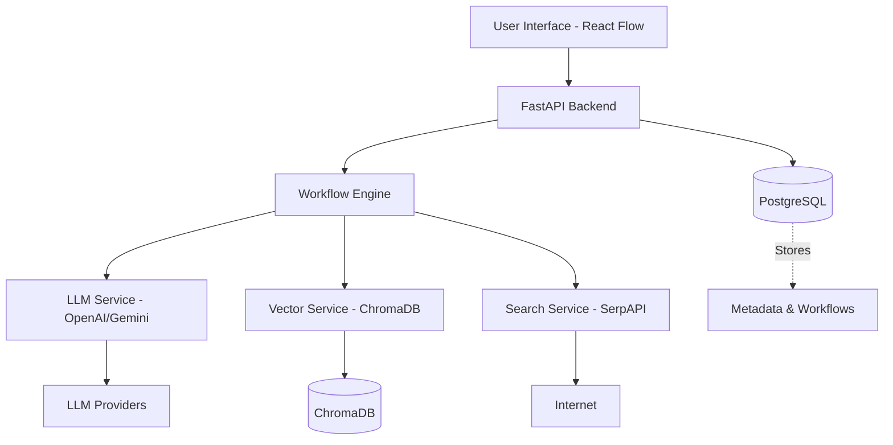

# FlowMind: No-Code AI Workflow Builder

A production-ready No-Code/Low-Code web application that allows users to visually create intelligent AI workflows using drag-and-drop components.

## Tech Stack

### Frontend
- **Framework**: React.js (Vite)
- **Workflow**: React Flow
- **Styling**: Tailwind CSS / styled-components
- **API Client**: Axios

### Backend
- **Framework**: FastAPI (Python)
- **LLM Integration**: OpenAI API, Gemini API
- **Search**: SerpAPI / Brave Search API
- **PDF Processing**: PyMuPDF
- **Database**: PostgreSQL (Workflow storage, History)
- **Vector Store**: ChromaDB (Knowledge base embeddings)

### DevOps
- **Containerization**: Docker
- **Orchestration**: Docker Compose

## Architecture



### Frontend Architecture
- **`/src/components/`**: Reusable UI components (Sidebar, Navbar, Buttons).
- **`/src/nodes/`**: Custom React Flow nodes (User Query, KnowledgeBase, Web Search, LLM Engine, Output).
- **`/src/pages/`**: Main Workspace and Dashboard pages.
- **`/src/store/`**: Application state (React Context/Zustand) for managing the graph and execution state.
- **`/src/services/`**: API layer for communicating with the backend.

### Backend Architecture
- **`/app/main.py`**: Application entry point.
- **`/app/api/`**: REST API Routes (v1/workflows, v1/chat, v1/upload).
- **`/app/core/`**: Configuration, logging, exception handling.
- **`/app/services/`**: logic for specific tasks:
    - `WorkflowEngine`: Traverses the graph and executes nodes.
    - `LLMService`: Handles calls to OpenAI/Gemini.
    - `VectorService`: Manages embedding generation and ChromaDB interactions.
    - `SearchService`: Handles web search using SerpAPI.
- **`/app/models/`**: Pydantic schemas and SQLAlchemy DB models.

## Workflow Execution Flow
1. **User Query Node**: Captures input.
2. **KnowledgeBase Node**: Retrieves relevant context from vector store based on query.
3. **Web Search Node**: Fetches real-time information from the internet.
4. **LLM Engine Node**: Constructs prompt (Query + RAG Context + Search Results) and calls LLM.
5. **Output Node**: Returns the response to the user.

## Setup Instructions

### Prerequisites
- Docker & Docker Compose
- Node.js (for local dev)
- Python 3.10+ (for local dev)

### Environment Variables
Create a `.env` file in the root directory:
```
OPENAI_API_KEY=...
GEMINI_API_KEY=...
SERPAPI_KEY=...
POSTGRES_USER=postgres
POSTGRES_PASSWORD=postgres
POSTGRES_DB=flowmind
DATABASE_URL=postgresql://postgres:postgres@db:5432/flowmind
```

### Deployment Guide

### Option 1: Docker Compose (Recommended for Production)
This will orchestrate the frontend, backend, PostgreSQL, and ChromaDB automatically.

1. **Configure Environment**:
   Ensure your `.env` file is ready with your API keys.
2. **Launch Services**:
   ```bash
   docker-compose up --build -d
   ```
3. **Access the App**:
   - Frontend: `http://localhost:3000`
   - Backend API: `http://localhost:8000`
   - API Docs: `http://localhost:8000/docs`

### Option 2: Kubernetes Deployment (Optional/Bonus)
The project includes Kubernetes manifests for scalable deployment.

1. **Create Secrets**:
   ```bash
   kubectl create secret generic flowmind-secrets \
     --from-literal=GEMINI_API_KEY=your_key \
     --from-literal=OPENAI_API_KEY=your_key \
     --from-literal=SERPAPI_KEY=your_key
   ```
2. **Apply Manifests**:
   ```bash
   kubectl apply -f kubernetes/db/
   kubectl apply -f kubernetes/chroma/
   kubectl apply -f kubernetes/backend/
   kubectl apply -f kubernetes/frontend/
   ```
3. **Verify Deployment**:
   ```bash
   kubectl get pods
   ```

## Development Setup

### Backend (FastAPI)
1. `cd backend`
2. `python -m venv venv`
3. `source venv/bin/activate` (or `venv\Scripts\activate` on Windows)
4. `pip install -r requirements.txt`
5. `uvicorn app.main:app --reload`

### Frontend (React + Vite)
1. `cd frontend`
2. `npm install`
3. `npm run dev`
